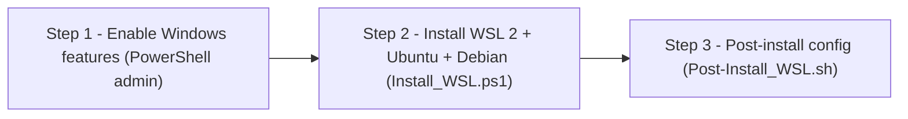

# WSL-Setup_Configuration


Legacy scripts (2024) to install and configure WSL 2 on Windows. Sets WSL 2 as the default version, installs Ubuntu and Debian, then configures the shell environment. Written to bootstrap a dev environment quickly - originally shared with classmates.

---

## Overview



### Project structure

```
WSL-Setup_Configuration/
├── Scripts_ps1/
│   └── Install_WSL.ps1     - WSL 2 install, Ubuntu + Debian, set default distro
└── Scripts_sh/
    └── Post-Install_WSL.sh - System update, base tools, custom prompt, neofetch
```

---

## Usage

### Step 1 - Enable Windows features

In PowerShell as Administrator:

```powershell
dism.exe /online /enable-feature /featurename:Microsoft-Windows-Subsystem-Linux /all /norestart
dism.exe /online /enable-feature /featurename:VirtualMachinePlatform /all /norestart
```

Reboot after running these commands.

### Step 2 - Install WSL 2

Download and run `Scripts_ps1/Install_WSL.ps1` in PowerShell as Administrator.

```powershell
.\Install_WSL.ps1
```

Installs WSL 2 with Ubuntu (default) and Debian. You will be prompted to create your UNIX username and password in the terminal.

Useful commands after install:

```powershell
# List installed distributions
wsl -l -v

# Launch a specific distro
wsl -d Ubuntu
wsl -d Debian

# Change default distro
wsl --set-default Debian
```

### Step 3 - Post-install configuration

Inside your WSL terminal:

```bash
apt-get install git -y
git clone https://github.com/Giremuu/WSL-Setup_Configuration.git
cd WSL-Setup_Configuration/Scripts_sh
chmod +x Post-Install_WSL.sh
./Post-Install_WSL.sh
```

The script will:
- Update and upgrade the system
- Install base tools: `curl`, `wget`, `git`, `neofetch`, `htop`, `net-tools`, `dnsutils`, `nmap`, `whois`, `unzip`, `vim`
- Set a custom bash prompt
- Enable neofetch at shell startup

Reload the shell after:

```bash
source ~/.bashrc
```

---

## License

MIT
